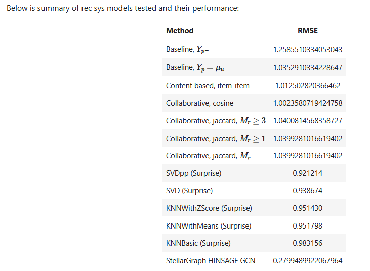

# Compare Graph Convolutional Network (GCN) and Sci-kit Learn's Surpise Library for Movie Recommendation

This project compares the hand crafted recsys classes developed in an earlier study against a GCN model built from the StellarGraph library and the Sci-kit Learn Surprise library. 

The dataset used is the MovieLens 100k dataset. I want to acknowledge this example of preparing MovieLens data for GCN modeling: https://github.com/hadoov/GHRS/blob/main/datasets/ml-100k/ua.base. I used this as a starting point.

The attached notebooks walks you through the data preparation steps including a graph model generated via StellarGraph, which handily splits the graph itself into training and test graphs. The model was then compiled and trained on the training data.

For Surprise evaluation, I chose SVD(), SVDpp(), KNNBasic(), KNNWithMeans(), KNNWithZScore() as the algorithms to compare, in order to provide a unique set of results as opposed to benchmarking the content-based and collaborative filtering algorithms. I also want to acknowledge this excellent Surpise example that inspired me: https://github.com/jadecebeci/Movie-Recommender-System/blob/main/Movie_Recommender_Modeling.ipynb. 

In future work, the StellarGraph model would need to be tuned to reduce overfitting. 

